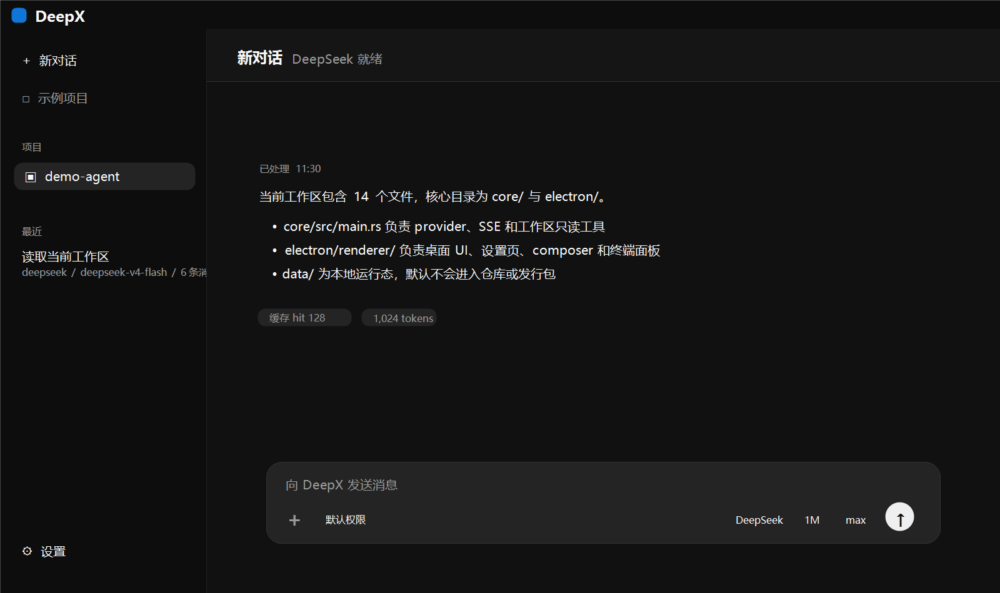

# DeepX

<p align="center">
  
</p>

<p align="center">
  
</p>

DeepX 是一个源码公开、非商业许可的本地 AI coding agent 桌面版。它把多模型 API 接入、项目工作区、对话、缓存指标、终端、本地文件 Agent 能力和应用内更新放在一个 Windows portable 应用里，用户自己填写 API key 即可使用。本项目100%由CodeX开发。

## 动机

我喜欢 Codex 桌面端的 UI 设计和以项目为中心的工作流，所以做了一个独立的 DeepX：界面方向强调高密度、项目工作区、底部输入框和本地 agent 体验；模型接入、配置目录、后端 core 和发行包都由 DeepX 自己维护。

DeepX 不是 DeepSeek 官方项目，也不是 OpenAI/Codex 官方项目。本项目与 DeepSeek 官方、OpenAI 官方均无隶属、背书或合作关系。

## 特性

- DeepSeek 优先的多服务商配置：DeepSeek、MiMo、GLM、Qwen、Kimi、StepFun、MiniMax，以及自定义 OpenAI-compatible provider。
- 用户本机 API key 存在 `data/secrets.local.json`，发行包默认不包含任何密钥。
- Portable Windows 发行版：应用运行时、配置、会话、日志、插件、skills、缓存指标都放在 DeepX 目录内。
- 项目式工作区：每个项目保留独立上下文和会话入口。
- 权限模式可选：默认权限、自动审查、完全访问权限、自定义配置。首版默认只读；写文件和 shell 只在完全访问权限下开放。
- Cache-first 上下文策略：稳定 prefix、prefix hash、cache hit/miss、命中率和费用估算。
- 本地终端面板：使用 PowerShell PTY，默认 cwd 为当前工作区。
- Markdown/GFM 渲染和本地代码高亮。
- 应用内检查更新：在主界面内联提示新版本，可下载并安装，更新时保留 `data/`、会话和 API key。

## 下载与运行

从 GitHub Releases 下载最新的 `DeepX-portable-v*.zip`：

https://github.com/RainyMarks/DeepX/releases

解压后运行 `DeepX.exe`。首次启动后进入“设置 -> 模型”，填写自己的 API key，点击保存并测试连接。不要把 `data/secrets.local.json` 提交到 GitHub。

后续可以在“设置 -> 常规 -> 应用更新”中检查新版本。应用内更新只替换程序文件，不覆盖 `data/` 目录。

## 源码构建

需要 Windows、PowerShell、Rust、Node.js、npm 和 Python。构建脚本会下载 Electron Windows runtime，生成 `DeepX.exe`，打包 `resources/app.asar`，并生成 portable zip。

```powershell
npm run package
npm run zip
```

常用检查：

```powershell
node --check .\electron\main.js
node --check .\electron\preload.js
node --check .\electron\renderer\app.js
cargo test --manifest-path .\core\Cargo.toml
npm run check:self-contained
```

## 目录结构

```text
core/                         Rust sidecar，provider、会话、工作区工具和 SSE
electron/                     Electron main/preload/renderer
resources/deepx-assets/       DeepX 图标资源
scripts/                      打包、图标生成和自包含检查脚本
data/                         本地运行态，默认不提交
releases/                     本地保留的 portable 发行包
```

## 安全边界

DeepX 的本地文件工具强制限制在用户选择的工作区内，并默认只读。发行包不应包含：

- API key、token、cookie、`.env`
- `data/secrets.local.json`
- 个人绝对路径
- 第三方账号登录入口
- 原始本机用户目录依赖

## 致谢

- Reasonix：cache-first agent 思路给了 DeepX 很多启发。
- DeepSeek-GUI：本地桌面模型接入和交互实践给了 DeepX 参考。
- Claude Code、Codex CLI、aider、Cline、Roo Code 等公开文档：为本地 agent loop、工具权限、项目指令和上下文管理提供了设计参考。

## License

DeepX 使用 `PolyForm-Noncommercial-1.0.0`。源码可以查看、学习、修改和在非商业场景中分发；未经授权不得用于商业目的。
